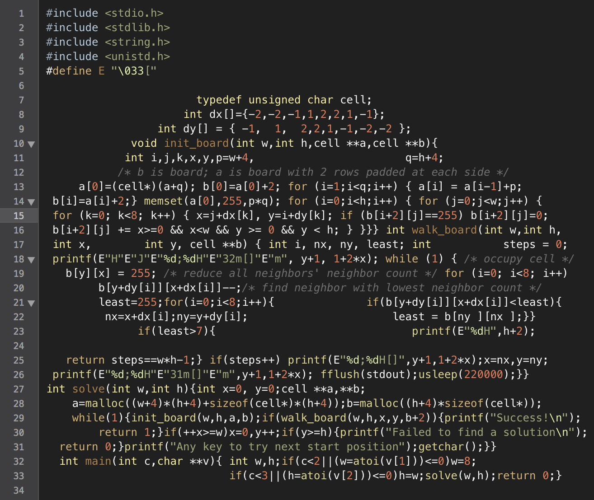

->  <-

## Outils de développement logiciel

L'ensemble des documents proviennent du cours d'outils de développement logiciel présenté depuis 2016 aux étudiants de la spécialité "Informatique" de l'[ENSICAEN](http://www.ensicaen.fr).

### Licences

* Les documents (cours, sujets de travaux pratiques et images) sont fournis sous licence Creative Commons [CC BY-NC-SA 4.0](https://creativecommons.org/licenses/by-nc-sa/4.0/)  

* Les éléments de solutions et exemples de code sont quant à eux diffusés sous licence [Apache 2.0](https://www.apache.org/licenses/LICENSE-2.0) 

-----

## Software Development Tools

All the documents come from my course presented since 2016 at the [ENSICAEN](http://www.ensicaen.fr).

### Licensing

* The documents (courses, laboratory work handouts and images) are provided under the Creative Commons [CC BY-NC-SA 4.0](https://creativecommons.org/licenses/by-nc-sa/4.0/) license  

* The code samples are licensed under the [Apache 2.0](https://www.apache.org/licenses/LICENSE-2.0) license 
